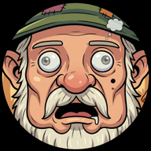

# Bob The Agent


A containerized multi-agent system that runs 24/7 autonomously via Docker Compose. Built with the Hermes Agents and Ollama for LLM inference.

## Features

- **Multi-Agent Architecture** — Specialized agents (orchestrator, researcher, simple tasks) each in their own container
- **Autonomous Operation** — Runs tasks without user interaction via Discord or CLI
- **Local & Cloud Models** — Uses Ollama for both local and cloud model inference
- **Web Search** — Built-in SearXNG metasearch engine (free, no API keys needed)
- **Skills** — X.com search, Grok search, AWS S3, data extraction, math operations, agent to agent communication
- **Discord Bot** — Chat with your agent through Discord
- **Delegation** — Main agent delegates specialized tasks to researcher and simple agents using NATS communication
- **Docker** — Easy deployment with Docker Compose

## Quick Start

### Prerequisites

- Docker Desktop or Docker Engine + Docker Compose v2
- Recommended at least 8GB RAM (4GB minimum)
- Optional: NVIDIA GPU for faster local inference if local models are used

### 1. Clone and Configure

```bash
git clone <repository-url>
cd bob-the-agent
cp .env.template .env
# Edit .env with your configuration
```

### 2. Build Image & Start Services

All agent services share a single `bob-the-agent:latest` image. Build it before starting:

```bash
# Option A: Build and start separately
docker build -t bob-the-agent:latest -f dockerfiles/Dockerfile.hermes .
docker compose up -d

# Option B: Build and start in one command
./run-docker.sh

# Option C: Pull from registry (if available)
docker pull your-registry/bob-the-agent:latest
docker tag your-registry/bob-the-agent:latest bob-the-agent:latest
docker compose up -d
```

### 3. Pull Ollama Models

```bash
# Pull local model (required)
docker exec bob-the-agent-ollama ollama pull qwen3.5:2b-q4_K_M

# Sign into Ollama for cloud models (recommended)
docker exec -it bob-the-agent-ollama ollama signin

# Pull cloud model manifests
docker exec bob-the-agent-ollama ollama pull kimi-k2.6:cloud
docker exec bob-the-agent-ollama ollama pull minimax-m2.7:cloud
```

### 4. Verify Installation

```bash
# Check all containers are running
docker compose ps

# Check main agent health
curl http://localhost:8642/healthz

# Check Ollama
curl http://localhost:11434/api/tags
```

### 5. Configure Discord Bot (Optional)

Set `DISCORD_BOT_TOKEN` and `DISCORD_CLIENT_ID` in `.env`, then restart:

```bash
docker compose restart agent-main
```

See [Discord Setup](docs/DISCORD_SETUP.md) for detailed instructions.

## Architecture

```
┌─────────────────────────────────────────────────────────────────┐
│                        Docker Compose                           │
│                                                                 │
│  ┌───────────┐                                                  │
│  │  ollama   │  LLM Inference (local + cloud models)           │
│  │  :11434   │                                                  │
│  └─────┬─────┘                                                  │
│        │                                                         │
│  ┌─────┴──────────────────────────────────────┐                 │
│  │                                             │                 │
│  │  ┌─────────────┐ ┌──────────┐ ┌──────────┐│                 │
│  │  │ agent-main  │ │researcher│ │  simple  │ │                 │
│  │  │  :8642      │ │  :8101   │ │  :8102   │ │                 │
│  │  │ Orchestrator│ │ Research │ │  Simple  │ │                 │
│  │  │ + Discord   │ │          │ │  Agent   │ │                 │
│  │  └─────────────┘ └──────────┘ └──────────┘ │                 │
│  └─────────────────────────────────────────────┘                 │
│                                                                 │
│  ┌─────────────┐  ┌─────────┐                                  │
│  │  SearXNG    │  │ Valkey  │  Web Search + Cache              │
│  │   :8888     │◄─┤ :6379   │                                  │
│  └─────────────┘  └─────────┘                                  │
└─────────────────────────────────────────────────────────────────┘
```

See [ARCHITECTURE.md](docs/ARCHITECTURE.md) for detailed diagrams and documentation.

## Configuration

### Environment Variables

| Variable | Description | Default |
|----------|-------------|---------|
| `LOG_LEVEL` | Logging level | `info` |
| `DISCORD_BOT_TOKEN` | Discord bot token | - |
| `SEARXNG_BASE_URL` | SearXNG base url | `http://searxng:8888` |
| `USER_X_COM_API_TOKEN` | X.com API token | - |
| `USER_XAI_SEARCH_API_KEY` | xAI API key for Grok search | - |
| `USER_AWS_S3_BUCKET` | AWS S3 Bucket | - |
| `USER_AWS_S3_REGION` | AWS S3 Region | - |
| `USER_AWS_S3_ACCESS_KEY_ID` | AWS Access Key | - |
| `USER_AWS_S3_SECRET_ACCESS_KEY` | AWS Secret Key | - |

### Agent Configuration

Each agent has its own configuration in `src/agents/{name}/hermes.partial.yml` that overrides the shared template at `src/config/hermes.template.yaml`. See [CONFIGURATION.md](docs/CONFIGURATION.md) for details.

### Volume Mounts

| Path | Purpose |
|------|---------|
| `./volumes/agent-main` | Main agent workspace (config, memory, skills) |
| `./volumes/agent-researcher` | Researcher agent workspace |
| `./volumes/agent-simple` | Simple agent workspace |

## Skills

Built-in skills for:
- agent to agent communication
- SearXNG web search capabilities
- x-com(Twitter) searching directly
- extracting data from URLs/documents and performing calculations.

## Development

### Project Structure

```
bob-the-agent/
├── compose.yaml              # Service orchestration
├── dockerfiles/
│   └── Dockerfile.hermes     # Hermes Agent container
├── src/
│   ├── agents/               # Agent definitions (main, researcher, simple)
│   │   ├── main/             # Main orchestrator
│   │   ├── researcher/       # Research specialist
│   │   └── simple/           # Simple task handler
│   ├── config/               # Hermes and SearXNG configuration
│   ├── scripts/              # Container setup and skill runner
│   └── skills/               # Skill implementations
├── volumes/                  # Runtime data (per-agent workspaces)
└── docs/                      # Documentation
```

### Building from Source

All agent services share a single `bob-the-agent:latest` image:

```bash
# Build the image
docker build -t bob-the-agent:latest -f dockerfiles/Dockerfile.hermes .

# Or build and start in one step
./run-docker.sh

# Rebuild after config changes (applies to all agents)
docker build -t bob-the-agent:latest -f dockerfiles/Dockerfile.hermes .
docker compose up -d
```

## Documentation

- [Architecture](docs/ARCHITECTURE.md) — System architecture and data flow
- [Configuration](docs/CONFIGURATION.md) — Detailed configuration options
- [Installation](docs/INSTALLATION.md) — Setup instructions
- [Discord Setup](docs/DISCORD_SETUP.md) — Discord bot configuration
- [Troubleshooting](docs/TROUBLESHOOTING.md) — Common issues and solutions

## License

MIT License